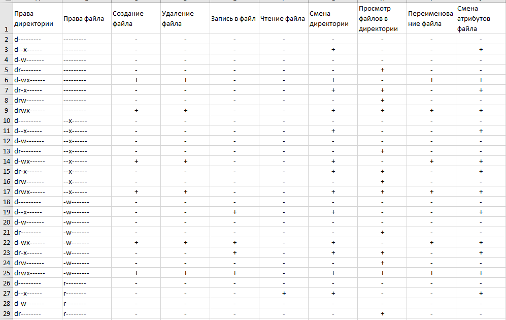
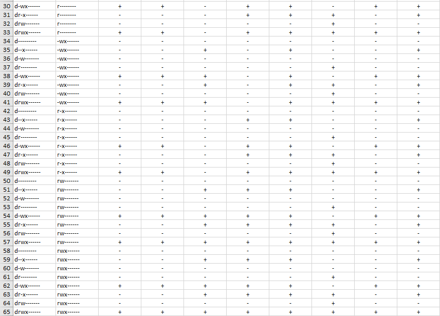
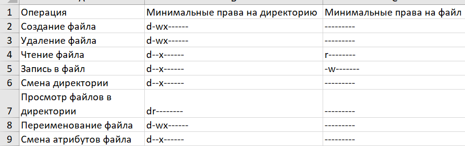

---
## Front matter
lang: ru-RU
title: Отчет по лабораторной работе №2
author: Дерябина Мария
institute: RUDN University, Moscow, Russian Federation
date: 2021

## Formatting
mainfont: Times New Roman
romanfont: Times New Roman
sansfont: Times New Roman
monofont: Times New Roman
toc: false
slide_level: 2
theme: metropolis
header-includes:
 - \metroset{progressbar=frametitle,sectionpage=progressbar,numbering=fraction}
 - '\makeatletter'
 - '\beamer@ignorenonframefalse'
 - '\makeatother'
aspectratio: 43
section-titles: true
---

## Цели работы

1. Получить практические навыков работы в консоли с атрибутами файлов
2. Закрепить теоретические основы дискреционного разграничения доступа в современных системах с открытым кодом на базе ОС Linux

## Задачи работы

1. Вспомнить основные команды для просмотра и изменения прав доступа.
2. Заполнить таблицу, сопоставляющую различные действия и права доступа.
3. Выявить минимальные необходимые права доступа для различных действий в системе.

## Выполнение. Создание нового пользователя

Создала нового пользователя Guest, переключилась на него. Уточнила имя пользователя и его группу командой id.

{#fig:002 width=70%}

## Права доступа домашних папок

Посмотрела права доступа домашних папок пользователей Guest и msderyabina, командой ls -l.
С помощью команды lsattr посмотрела расширенные атрибуты папок.

{#fig:004 width=70%}

## Изменениа прав доступа

Сняла с папки dir1 все атрибуты и попыталась создать в ней файл. Это не удалось, потому что для создания файла нужны права
на запись и выполнение в данной директории. 

{#fig:005 width=70%}

## Таблица «Установленные права и разрешённые действия»

{#fig:007 width=70%}

## Таблица «Установленные права и разрешённые действия»

{#fig:008 width=70%}

## Таблица «Минимальные права для совершения операций»

{#fig:009 width=70%} 

## Выводы

Я получила практические навыков работы в консоли с атрибутами файлов, закрепила теоретические основы дискреционного разграничения доступа в современных системах с открытым кодом на базе ОС Linux.

