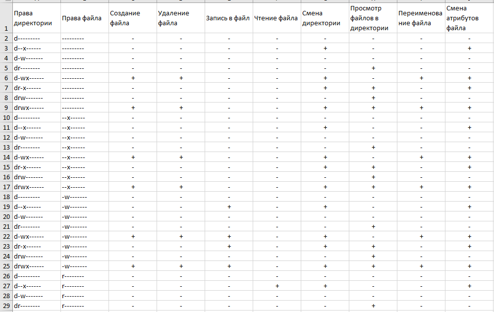
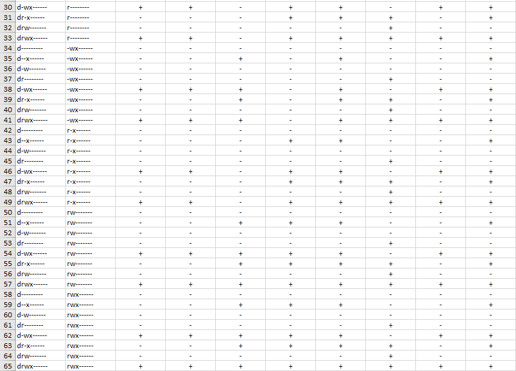
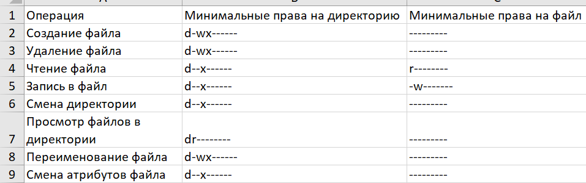

---
# Front matter
lang: ru-RU
title: "Отчёт по лабораторной работе"
subtitle: "Лабораторная №2"
author: "Дерябина Мария Сергеевна"

# Formatting
toc-title: "Содержание"
toc: true # Table of contents
toc_depth: 2
lof: true # List of figures
lot: true # List of tables
fontsize: 12pt
linestretch: 1.5
papersize: a4paper
documentclass: scrreprt
polyglossia-lang: russian
polyglossia-otherlangs: english
mainfont: Times New Roman
romanfont: Times New Roman
sansfont: Times New Roman
monofont: Times New Roman
mainfontoptions: Ligatures=TeX
romanfontoptions: Ligatures=TeX
sansfontoptions: Ligatures=TeX,Scale=MatchLowercase
monofontoptions: Scale=MatchLowercase
indent: true
pdf-engine: lualatex
header-includes:
  - \linepenalty=10 # the penalty added to the badness of each line within a paragraph (no associated penalty node) Increasing the value makes tex try to have fewer lines in the paragraph.
  - \interlinepenalty=0 # value of the penalty (node) added after each line of a paragraph.
  - \hyphenpenalty=50 # the penalty for line breaking at an automatically inserted hyphen
  - \exhyphenpenalty=50 # the penalty for line breaking at an explicit hyphen
  - \binoppenalty=700 # the penalty for breaking a line at a binary operator
  - \relpenalty=500 # the penalty for breaking a line at a relation
  - \clubpenalty=150 # extra penalty for breaking after first line of a paragraph
  - \widowpenalty=150 # extra penalty for breaking before last line of a paragraph
  - \displaywidowpenalty=50 # extra penalty for breaking before last line before a display math
  - \brokenpenalty=100 # extra penalty for page breaking after a hyphenated line
  - \predisplaypenalty=10000 # penalty for breaking before a display
  - \postdisplaypenalty=0 # penalty for breaking after a display
  - \floatingpenalty = 20000 # penalty for splitting an insertion (can only be split footnote in standard LaTeX)
  - \raggedbottom # or \flushbottom
  - \usepackage{float} # keep figures where there are in the text
  - \floatplacement{figure}{H} # keep figures where there are in the text
---

# Цель работы

Получить практические навыков работы в консоли с атрибутами файлов, закрепить теоретические основы дискреционного разграничения доступа в современных системах с открытым кодом на базе ОС Linux

# Задачи работы

1. Вспомнить основные команды для просмотра и изменения прав доступа.
2. Заполнить таблицу, сопоставляющую различные действия и права доступа.
3. Выявить минимальные необходимые права доступа для различных действий в системе.

# Выполнение лабораторной работы

Создала нового пользователя Guest и задала для него пароль (рис. -@fig:001).

{#fig:001 width=70%}

Переключилась на нового пользователя, с помощью команд pwd, whoami проверила, что я нахожусь под правильным пользователем.
Уточнила имя пользователя и его группу командой id. (рис. -@fig:002).

{#fig:002 width=70%}

Посмотрела файл /etc/passwd. uid и gid в этом файле совпадают с выводом команды id. (рис. -@fig:003).

{#fig:003 width=70%}

Посмотрела права доступа домашних папок пользователей Guest и msderyabina, командой ls -l. У каждой папки есть полные права доступа для владельца и нет никаких прав для группы или остальных пользователей. С помощью команды lsattr посмотрела расширенные атрибуты папок - это удалось сделать только папки текущего пользователя Guest. Расширенные атрибуты msderyabina посмотреть не удалось.
 (рис. -@fig:004).

Далее я создала папку dir1 в домашнем каталоге. По умолчанию у нее были выставлены все права доступа кроме записи для других пользователей. Расширенных атрибутов по умолчанию не было выставлено.

{#fig:004 width=70%}

Сняла с папки dir1 все атрибуты и попыталась создать в ней файл. Это не удалось, потому что для создания файла нужны права
на запись и выполнение в данной директории. (рис. -@fig:005).

{#fig:005 width=70%}

Заполнила таблицу «Установленные права и разрешённые действия», выполняя действия от имени владельца директории (файлов), определив опытным путём, какие операции разрешены, а какие нет. Для этого использовала команды chmod, ls, echo, cat, mv, cd, rm, touch.
(рис. -@fig:006, рис. -@fig:007, рис. -@fig:008).

{#fig:006 width=70%}

{#fig:007 width=70%}

{#fig:008 width=70%}

На основании заполненной таблицы определила минимально необходимые права для выполнения операций внутри директории
dir1. (рис. -@fig:009).

{#fig:009 width=70%} 

# Вывод

Я получила практические навыков работы в консоли с атрибутами файлов, закрепила теоретические основы дискреционного разграничения доступа в современных системах с открытым кодом на базе ОС Linux.
